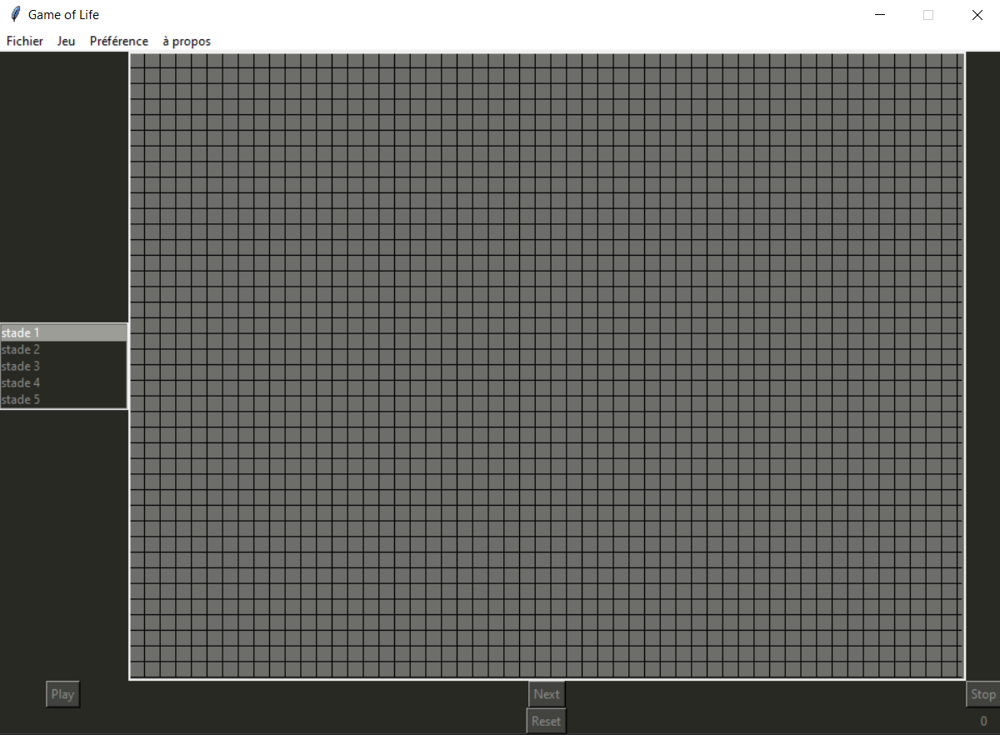
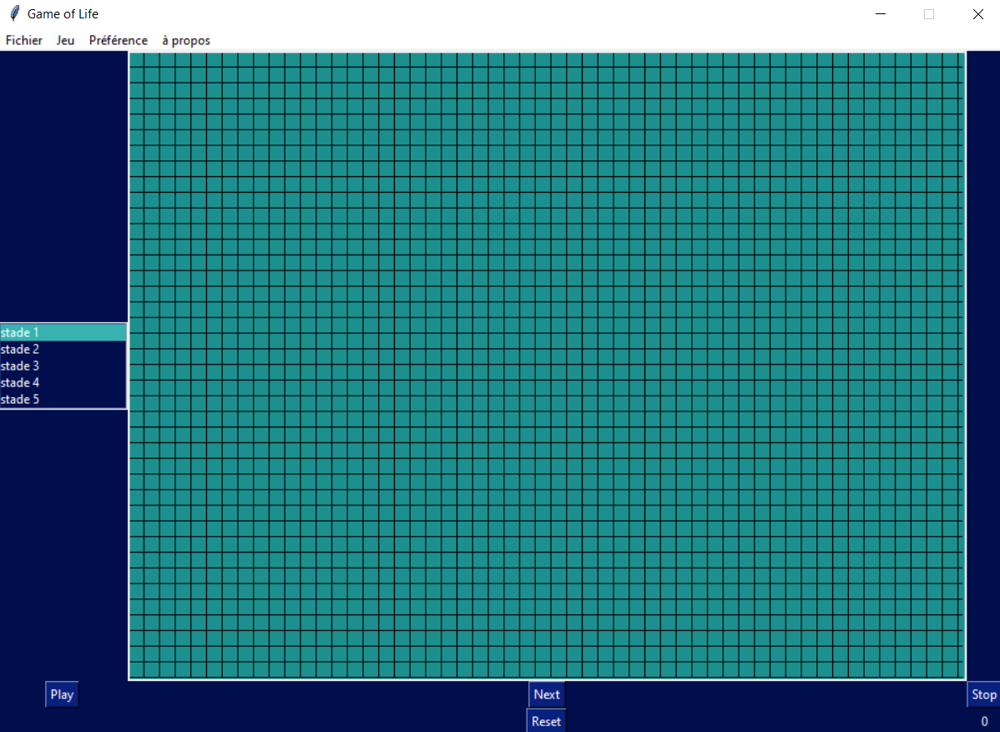
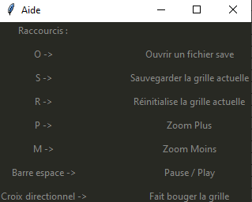

# GameOfLife

## Description 

This is an old college project. A friend and I recreated a game of life with the knowledge we had.

Here is the description of the GameOfLife found on wikipedia :

>The Game of Life, also known simply as Life, is a cellular automaton devised by the British mathematician John Horton Conway in 1970. It is a zero-player game, meaning that its evolution is determined by its initial state, requiring no further input. One interacts with the Game of Life by creating an initial configuration and observing how it evolves. It is Turing complete and can simulate a universal constructor or any other Turing machine. 

If you want to look deeper into the subject and rules of this game, you can see it right [here](https://en.wikipedia.org/wiki/Conway%27s_Game_of_Life) 

---
## Install 

To use this, you only need python3 and Tkinter

---
## How to use 

### Basic use

The default appearance of the Window is this : 

You can add / delete cells from the grid just by clicking on a spot on the grid

Then, you can hit play to start the simulation and stop to stop the simulation.

This game supports different states of cells, this is why you can see "stade 2", 3, 4 etc.

---
### Saves

You can save states of the game just by hitting "S" on your keyboard.
You can also do it by clicking "Fichier" > "Sauver".

There are some default saves coming when you clone the project : 
- clock: This is just a clock structure in the GameOfLife
- Pistolet: this is a glider gun structure : It created an infinit amount of glider
- planeur: This is just several patterns for gliders

---
### Themes

You can also change the theme of the game by clicking on "Préférence" > "Changer de theme".
There are 2 default themes : `dark` and `blue`.

Here is what the blue theme looks like : 

---
### Help

You can see all the commands and keyboard shortcuts by going into "à propos" > "aide".

